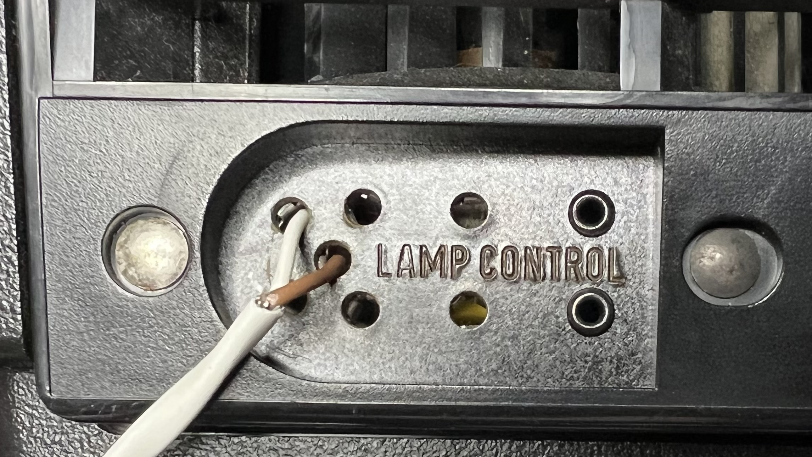

# Raspberry Pi Automated Slide Scanner #

Got 100s or even 1000s of slides to digitize?   All you need is a raspberry Pi, a windows machine, and a few other parts to have an automated slide scanner that can run through entire carousels within minutes!

I take no credit for this.  This is entirely the work of Phil Ivers who posted on youtube [an amazing tutorial for how to build this](https://www.youtube.com/watch?v=XPCpwcn2Q6w) and loosely mentioning his code in the comments section.  All I'm doing is just putting this into one contained git repo for documentation sake.

## Parts ##

1. DSLR camera + tripod
2. 'LEE' brand #216 White Diffusion Filter
3. MR11 35W Halogen Bulb
4. 12VDC Power Supply
5. RasperryPi (with wifi)
6. JBtek 4 Channel DC 5V Relay Module for Arduino Raspberry Pi
7. Kodak 4200 Slide Projector

## Building ##

1. Remove factory bulb from the projector and replace with MR11 35W Halogen bulb (use paperclip to hold into place).
2. Solder wires onto the bulb pins and run out externally to a 12V power supply (polarity not important).
3. Cut diffusion filter to size and tape (with kapton tape) over lens.
4. Re-insert lamp assembly.
5. Wire the following:
   5.1 Wire pin #6 (GND) of Pi to GND pin of relay board.
   5.2 Wire pin #4 (5V Power) of Pi to Vcc pin of relay board
   5.2 Wire pin #3 (GPIO 2) to IN1 pin of relay board.
   5.3 Wire the normally open (NO) pins of relay #1 to the projector remote advance pins (upper-left and center pins) as shown here:

6. Power on projector (make sure fans run).
7. Power on 12VDC power supply.
8. Load slides into projector.
9. Setup camera on tripod, align, focus.
10. Connect DSLR camera via USB to windows machine.

## Running ##

1. Download and install [digiCamControl](http://digicamcontrol.com/)
1. In digiCamControl options, enable webserver.  Leave on default port 5513.  This sets up a webserver to allow digiCamControl to be remotely controlled over RESTful URLs.
1. SCP `picam.py` file over to the Pi board
1. Run python script (`python picam.py`)
1. Either:
    * In another terminal (tmux/screen/byobu) run: `curl  http://localhost:8080/advance/<IP of digiCamControl machine>/1`
    * On digiCamControl windows machine, run `curl  http://<IP of Pi>:8080/advance/<IP of digiCamControl machine>/1`

    For example, if my windows machine running digiCamControl is 192.168.1.101, I will SSH into the Pi and (while also leaving python picam.py running in another terminal session) run: `curl http://localhost:8080/advance/192.168.1.101/1`
1. Changing the last value of the URL represents how many slides to scan automatically (such as 80 to scan an entire slide carousel)
1. digiCamControl is powerful, head on over to the "auto export plugins" section and click on "add plugin".  From there you can select "transforms" that do things like auto-rotate the images as they come in (useful for slide carousels where slides are upside down)

## How it works ##

`picam.py` sets up a simple webserver on port 8080 on the pi.  When a URL request comes in with the path `/advance/<some IP address>/<some integer number>` it will lower the Pi GPIO pin#2 for 250 milliseconds which causes the relay to control the projector to advance to the next slide.  Then it will make a remote request to the digiCamControl webserver at `<some IP address>` to cause digiCamControl to snap a photo, which itself commands via USB the DSLR camera to snap the photo and stream the image over USB.  The `<some integer number>` is used in the python script as an argument to choose how many times it will loop over this operation, thus allowing full automatic autonomous operation over an entire slide carousel.